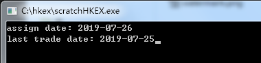
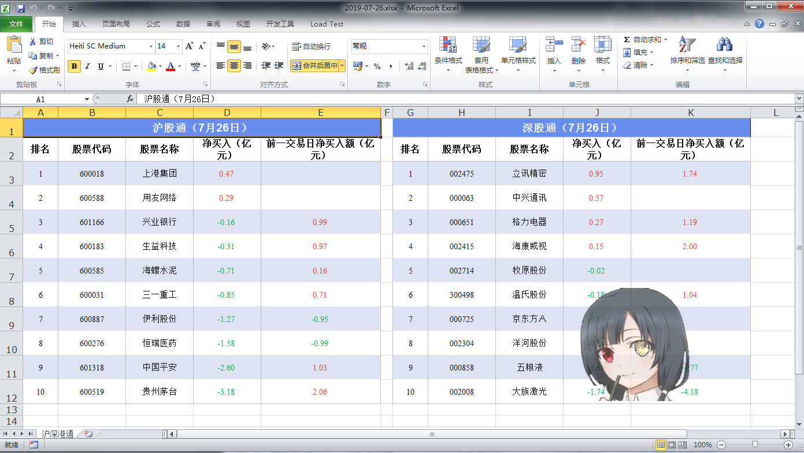
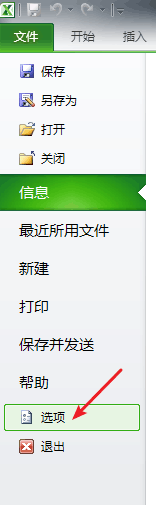
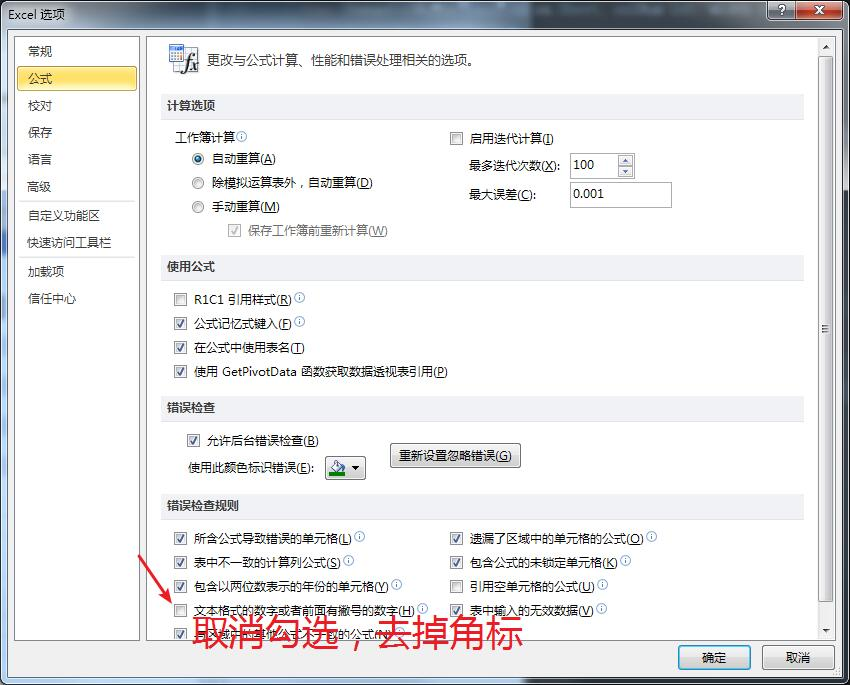

# 港交所北上资金数据抓取报表生成器

* 原查询页面：https://sc.hkex.com.hk/TuniS/www.hkex.com.hk/Mutual-Market/Stock-Connect/Statistics/Historical-Daily
* 发布下载：https://github.com/overlordsnyt/hkexmarketdata/releases/tag/v1.2

## 更新

2022-2-14 增加代理设置的支持

## 使用说明

已编译平台： windows x86 windows x64

1. 双击scratchHKEX_xXX.exe运行程序。
1.  输入形如“2006-01-02”格式的日期，assgin date表示指定交易日日期，last trade date表示上一交易日日期。
1. 默认读取同级目录下名为“watermark.png”的图片，作为水印插入到生成的excel文件中。要读取的文件名可在setting.ini中配置。
1. 生成和assign date同名的xlsx后缀excel文件，即为结果。如：2019-07-26.xlsx

### 注意：
* 第一次运行会按照默认设置生成setting.ini，之后运行则会读取该配置。
* assign date所指定的日期在港交所网站上必须是有数据的交易日，否则程序不会生成excel。
* last trade date须由用户自己指定，故而不能限制是否为真的为上一交易日。
* last trade date指定的上一交易日日期抓取到的数据可以为空数据集。

## 功能说明

本程序是由抓取港交所的深股通、沪股通数据生成excel的工具。

### 特色

* 可指定行列的长宽
* 自动插入水印，指定水印位置
* 按指定交易日净买入量降序排列
* 抓取指定交易日、前一交易日并自动匹配关联同一股票代码下的数据，增减一目了然

## 其他说明

### 去掉excel的文本格式警告角标（单元格左上绿色三角）
1. 
1. 